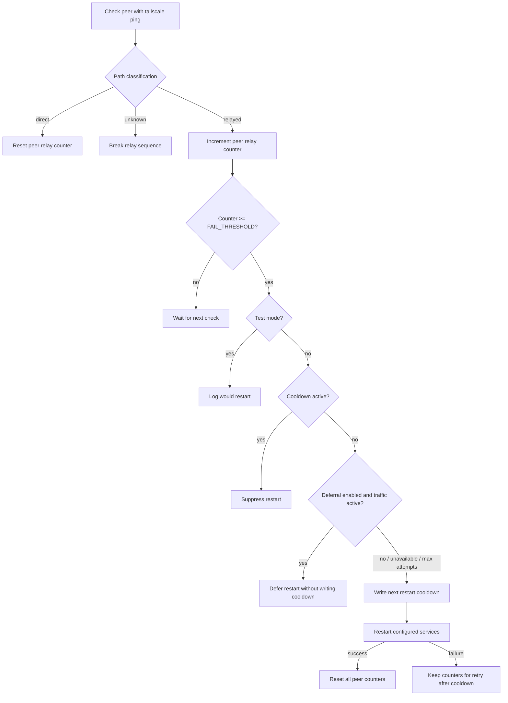

# Daemon Behavior

The daemon monitors configured peers and restarts local Tailscale services only after sustained evidence that a monitored peer is relay-only.

## Peer Classification

`tailscale ping` output is classified as:

- `direct`: at least one usable `pong from ... via ...` line is not DERP and not peer-relay.
- `relayed`: one or more usable pongs are DERP or peer-relay, and no direct pong appears.
- `unknown`: no usable pong path is found.

Unknown output breaks the relayed sequence. It is not treated as relayed because timeouts, parse changes, offline peers, and transient command failures are not enough evidence to restart router services.

## Peer State

The daemon stores per-peer state in memory:

- relay count;
- last state;
- threshold marker used to avoid repeating the same suppression log on every loop.

No per-peer state is persisted across daemon restarts. That keeps normal operation quiet and avoids turning every health check into a disk write.

## Restart Controls

Restart controls are global because restarting local Tailscale services affects all Tailscale traffic on the router.

The active cooldown file is:

```text
/var/run/tailscale_watchdog/next_restart_allowed
```

The file stores the epoch when another restart attempt is allowed. The daemon writes it immediately before a real service restart attempt. That means a failed restart still consumes cooldown, which prevents immediate retry loops.

Restart deferral, when enabled, samples interface-wide byte counters on `RESTART_DEFERRAL_INTERFACE`. If traffic is above `RESTART_DEFERRAL_MAX_BYTES`, the daemon defers without writing cooldown. Deferrals are bounded by `RESTART_DEFERRAL_MAX_ATTEMPTS`.

If activity detection is unavailable, malformed, interrupted, or otherwise unsupported, the daemon logs the problem and proceeds with the restart decision. That preserves the older behavior instead of letting a broken activity check suppress restarts forever.

## How Services Are Restarted

The daemon restarts `pfsense_tailscaled` only, and it does so by running the service's `stop` and `start` as separate steps rather than issuing `service ... restart`. Both choices exist to match what the pfSense GUI's service control does, because a plain `restart` was measurably worse at recovering a direct path.

### Why only `pfsense_tailscaled`

`pfsense_tailscaled` is a wrapper around the upstream `tailscaled` rc file. Its `stop` and `start` already cycle `tailscaled` underneath through `run_rc_script`, so naming `tailscaled` separately bounces the daemon twice for no benefit.

The wrapper also has no `restart_cmd`, so rc.subr expands `restart` into stop plus start — and `start` carries a post-start hook that does the work a bare `tailscaled` restart never does:

- waits for `tailscale0` to reappear;
- re-adds `tailscale0` to the `Tailscale` interface group;
- runs `tailscale up` with the configured flags;
- reloads the packet filter via `/etc/rc.filter_configure_sync`.

Restarting `tailscaled` on its own skips all of it. The pfSense GUI never restarts `tailscaled`; it restarts `pfsense_tailscaled` alone.

### Why stop and start are separate

The GUI's service control runs the rc file's `stop`, then its `start`, as two separate processes. rc.subr's `restart` instead runs `( stop )` and `( start )` back to back in a single shell with no gap at all.

That gap matters because the post-start hook is fragile in two ways, and both fail silently:

- it waits only a few seconds for `tailscale0` to reappear, and returns early if it does not — skipping the interface group, `tailscale up`, and the filter reload;
- rc.subr skips a post-start hook entirely when the start command reports a non-zero status, which the wrapper does when it finds `tailscaled` already running.

`RESTART_SETTLE_SECONDS` (default 3) is the pause between the stop and the start. Set it to 0 to stop and start back to back.

The stop's exit status is deliberately ignored. The GUI skips the stop when the service is not running, and the wrapper's stop returns non-zero when `tailscaled` is already down; neither is a failure. Only the start decides whether the restart succeeded, which keeps the success and failure paths — counter reset versus counter retention — unchanged.

The settle pause uses a plain `sleep` rather than the interruptible sleep used between checks. Letting a signal cut it short would leave Tailscale stopped, so shutdown waits the pause out.

## Decision Flow



## Logging

The daemon logs notable transitions, suppression decisions, restart decisions, restart cooldown selection, service restart results, notification failures, and shutdown. When enabled and configured, it also sends a startup notification for normal long-running daemon starts. Notifications include the local router's Tailscale name, detected from local Tailscale status unless `LOCAL_TAILSCALE_NAME` is set in the config.

It does not log every successful direct check. Quiet logs during healthy operation are intentional.

Peer names are safe to log and send in notifications. Provider secrets such as tokens, user keys, and webhook URLs are not.
