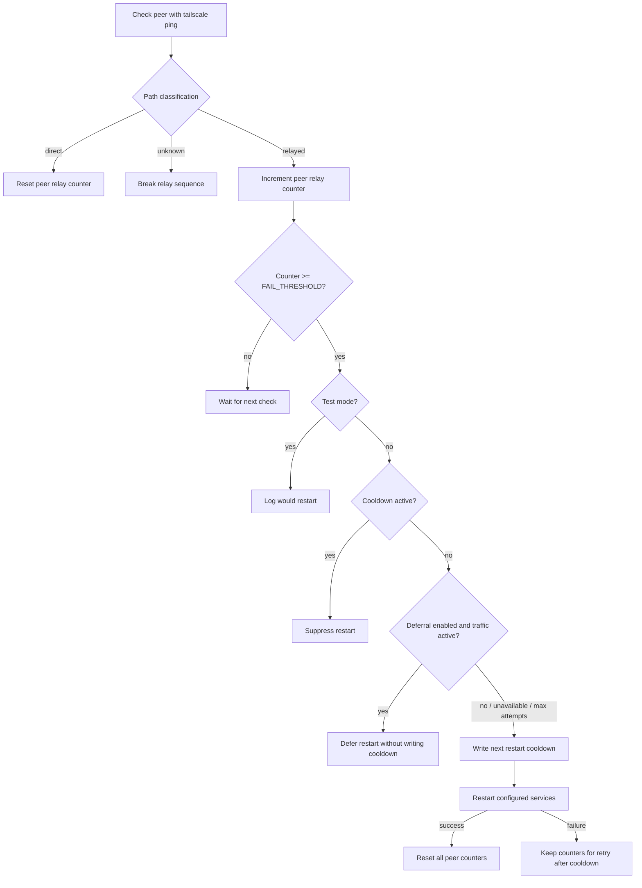

# Daemon Behavior

The daemon monitors configured peers and restarts local Tailscale services only after sustained evidence that a monitored peer is relay-only.

## Peer Classification

`tailscale ping` output is classified as:

- `direct`: at least one usable `pong from ... via ...` line is not DERP and not peer-relay.
- `relayed`: one or more usable pongs are DERP or peer-relay, and no direct pong appears.
- `unknown`: no usable pong path is found.

Unknown output breaks the relayed sequence. It is not treated as relayed because timeouts, parse changes, offline peers, and transient command failures are not enough evidence to restart router services.

## Peer State

The daemon stores per-peer state in memory:

- relay count;
- last state;
- threshold marker used to avoid repeating the same suppression log on every loop.

No per-peer state is persisted across daemon restarts. That keeps normal operation quiet and avoids turning every health check into a disk write.

## Restart Controls

Restart controls are global because restarting local Tailscale services affects all Tailscale traffic on the router.

The active cooldown file is:

```text
/var/run/tailscale_watchdog/next_restart_allowed
```

The file stores the epoch when another restart attempt is allowed. The daemon writes it immediately before a real service restart attempt. That means a failed restart still consumes cooldown, which prevents immediate retry loops.

Restart deferral, when enabled, samples interface-wide byte counters on `RESTART_DEFERRAL_INTERFACE`. If traffic is above `RESTART_DEFERRAL_MAX_BYTES`, the daemon defers without writing cooldown. Deferrals are bounded by `RESTART_DEFERRAL_MAX_ATTEMPTS`.

If activity detection is unavailable, malformed, interrupted, or otherwise unsupported, the daemon logs the problem and proceeds with the restart decision. That preserves the older behavior instead of letting a broken activity check suppress restarts forever.

## How Services Are Restarted

The daemon restarts `pfsense_tailscaled` only, and it does so by running the service's `stop` and `start` as separate steps rather than issuing `service ... restart`. Both choices exist to match what the pfSense GUI's service control does, because a plain `restart` was measurably worse at recovering a direct path.

### Why only `pfsense_tailscaled`

`pfsense_tailscaled` is a wrapper around the upstream `tailscaled` rc file. Its `stop` and `start` already cycle `tailscaled` underneath through `run_rc_script`, so naming `tailscaled` separately bounces the daemon twice for no benefit.

The wrapper also has no `restart_cmd`, so rc.subr expands `restart` into stop plus start — and `start` carries a post-start hook that does the work a bare `tailscaled` restart never does:

- waits for `tailscale0` to reappear;
- re-adds `tailscale0` to the `Tailscale` interface group;
- runs `tailscale up` with the configured flags;
- reloads the packet filter via `/etc/rc.filter_configure_sync`.

Restarting `tailscaled` on its own skips all of it. The pfSense GUI never restarts `tailscaled`; it restarts `pfsense_tailscaled` alone.

### Why stop and start are separate

The GUI's service control runs the rc file's `stop`, then its `start`, as two separate processes. rc.subr's `restart` instead runs `( stop )` and `( start )` back to back in a single shell with no gap at all.

That gap matters because the post-start hook is fragile in two ways, and both fail silently:

- it waits only a few seconds for `tailscale0` to reappear, and returns early if it does not — skipping the interface group, `tailscale up`, and the filter reload;
- rc.subr skips a post-start hook entirely when the start command reports a non-zero status, which the wrapper does when it finds `tailscaled` already running.

`RESTART_SETTLE_SECONDS` (default 3) is the pause between the stop and the start. Set it to 0 to stop and start back to back.

The stop's exit status is deliberately ignored. The GUI skips the stop when the service is not running, and the wrapper's stop returns non-zero when `tailscaled` is already down; neither is a failure. Only the start decides whether the restart succeeded, which keeps the success and failure paths — counter reset versus counter retention — unchanged. It is still logged through `logger`, because a stop that fails for some *other* reason is the one condition that makes this whole sequence ineffective: rc.subr skips the post-start hook when the start finds the daemon still running, and the restart would otherwise be reported as a success with nothing in syslog to explain the persistent relaying.

### Shutdown during a restart

Splitting the restart creates a window in which the service has been stopped and not yet started. Exiting there would leave Tailscale down on the router with nothing to bring it back: a watchdog started against a dead Tailscale classifies every peer as `unknown`, and `unknown` breaks the relayed sequence, so it would never restart the service on its own. That includes losing remote access to the router.

POSIX defers a trapped signal until the running foreground command completes and then runs the trap, so this is not a narrow race — any `TERM` delivered from the first stop onwards lands in the window. The single-command `service ... restart` was immune by construction; the split form is not.

So the loop is a critical section. `handle_shutdown` records the request in `SHUTDOWN_PENDING` and returns instead of exiting while `RESTART_CRITICAL` is set; `restart_tailscale_services` exits once every stopped service has had its start attempted and the shell options are restored. The exit happens before the notification block, because the rc wrapper allows only a few seconds before escalating to `SIGKILL` and spending them on a `curl` call would risk being killed anyway.

The settle pause uses a plain `sleep` rather than the interruptible `watchdog_sleep`. That is not what protects the start — the critical section is. `watchdog_sleep` exists so the main loop's inter-check wait can be cut short, which needs `SLEEP_PID` bookkeeping that only makes sense outside a restart.

`RESTART_SETTLE_SECONDS` is capped at 4 for a related reason. `tailscale_watchdog_stop` in the rc wrapper sends `TERM` and escalates to `SIGKILL` after 10 seconds, and `SIGKILL` cannot be deferred. (The 5-second escalation in `kill_and_wait` is a different path — it only cleans up a just-started daemon whose pidfile write failed, which cannot be mid-restart.) If a `SIGKILL` landed while a settle was still sleeping, that service would be stopped and never started.

The deadline is a single budget measured from the `TERM`, while the critical section spans the whole `RESTART_SERVICES` list — so a per-service bound would not be enough. With two services and a 3-second settle, the sleeps alone consume 6 seconds before either `service` invocation's own runtime, and the second service could still be stopped when the `SIGKILL` arrives. That is the same unrecoverable state, and on a preserved config it would strand `pfsense_tailscaled` specifically, since it is the second entry.

So settles that have not started yet are skipped once a shutdown is pending. A settle already sleeping runs to completion, because the trap cannot run until the sleep returns; settles not yet reached are dropped. At most one full settle therefore sits on the deadline path, however many services are configured, and the cap is sized against that single pause. Only the stops and starts remain — and the wrapper signals only the daemon's own pid, so an in-flight start completes regardless.

Skipping the pauses costs settling quality on the way down. That is the right trade: leaving a service stopped is unrecoverable, a less effective final restart is not.

Raising the cap requires raising the wrapper's 10-second window in step. The cap is validated before use because it lives in the namespace the live config is sourced into, and a non-numeric value would make the comparison error out and take the else branch — silently disabling the bound rather than rejecting the config.

The daemon does not bound the critical section itself. A `stop` blocked on a wedged `tailscaled`, or a `start` waiting on `tailscale0`, holds it open for as long as those take, and `TERM` and `INT` are both deferred for that whole time. That is inherent to the deferral and is the correct trade against exiting mid-restart, but it does mean the cap governs only the portion of the window the daemon controls.

## Decision Flow



## Logging

The daemon logs notable transitions, suppression decisions, restart decisions, restart cooldown selection, service restart results, notification failures, and shutdown. When enabled and configured, it also sends a startup notification for normal long-running daemon starts. Notifications include the local router's Tailscale name, detected from local Tailscale status unless `LOCAL_TAILSCALE_NAME` is set in the config.

It does not log every successful direct check. Quiet logs during healthy operation are intentional.

Peer names are safe to log and send in notifications. Provider secrets such as tokens, user keys, and webhook URLs are not.
