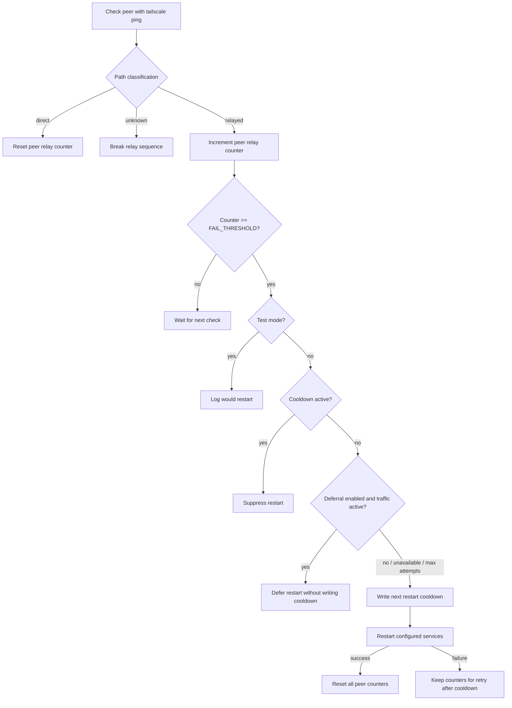

# Daemon Behavior

The daemon monitors configured peers and restarts local Tailscale services only after sustained evidence that a monitored peer is relay-only.

## Peer Classification

`tailscale ping` output is classified as:

- `direct`: at least one usable `pong from ... via ...` line is not DERP and not peer-relay.
- `relayed`: one or more usable pongs are DERP or peer-relay, and no direct pong appears.
- `unknown`: no usable pong path is found.

Unknown output breaks the relayed sequence. It is not treated as relayed because timeouts, parse changes, offline peers, and transient command failures are not enough evidence to restart router services.

## Peer State

The daemon stores per-peer state in memory:

- relay count;
- last state;
- threshold marker used to avoid repeating the same suppression log on every loop.

No per-peer state is persisted across daemon restarts. That keeps normal operation quiet and avoids turning every health check into a disk write.

## Restart Controls

Restart controls are global because restarting local Tailscale services affects all Tailscale traffic on the router.

The active cooldown file is:

```text
/var/run/tailscale_watchdog/next_restart_allowed
```

The file stores the epoch when another restart attempt is allowed. The daemon writes it immediately before a real service restart attempt. That means a failed restart still consumes cooldown, which prevents immediate retry loops.

That path is fixed. `STATE_DIR` and the `NEXT_RESTART_FILE` derived from it are assigned in `reset_runtime_state`, alongside the rest of the internal state the live config is not allowed to reach, rather than in the config-defaults block above it. Two things make them a poor setting even though they look like one. `uninstall.sh` hardcodes `/var/run/tailscale_watchdog` to remove it, so state relocated by a config line would outlive the uninstall the project promises to be complete. And moving state onto persistent storage changes whether a cooldown survives a reboot — a real behavior decision about how long a router stays suppressed after a restart attempt, which should not be a side effect of a path edit.

Deriving the two together in one pass is the fix for a specific failure. They previously sat in the defaults block with `NEXT_RESTART_FILE` expanded from `STATE_DIR` exactly once, at parse time, so a config assigning only `STATE_DIR` moved the directory and left the file behind in the old one. `mark_restart_attempt` then created the new directory, `mktemp`'d its temp file inside it, and `mv`'d the result into a directory that no longer existed. The move failed, `mark_restart_attempt` returned non-zero, and `restart_tailscale_services` returned before touching any service. The watchdog kept checking peers and kept declining to restart, for the life of the install, with nothing in the logs that named the config line responsible.

A config that assigns either name is discarded like the rest of the block, and `warn_ignored_state_paths` logs which one and where state actually lives whenever the assigned value differs from the fixed one. Assigning the fixed value changes nothing and is not logged. Discarding silently would leave an operator watching a setting have no effect, unable to tell a rejected value from a broken daemon — which is close to the state the original bug produced.

One upgrade case is worth knowing. An operator who set *both* names consistently — the single config shape the old bug did not break, typically to put cooldown on persistent storage so it survives a reboot — has their state move back to `/var/run` on the next start. The accumulated cooldown goes with it: `cooldown_remaining` finds no file, returns 0, and the next threshold crossing may restart immediately rather than waiting out the interval the old file recorded. It is bounded, one-time, and still gated by `FAIL_THRESHOLD`, and the new warning names the cause. The orphaned directory is left in place; `uninstall.sh` only knows `/var/run/tailscale_watchdog`, so it needs removing by hand.

Restart deferral, when enabled, samples interface-wide byte counters on `RESTART_DEFERRAL_INTERFACE`. If traffic is above `RESTART_DEFERRAL_MAX_BYTES`, the daemon defers without writing cooldown. Deferrals are bounded by `RESTART_DEFERRAL_MAX_ATTEMPTS`.

If activity detection is unavailable, malformed, interrupted, or otherwise unsupported, the daemon logs the problem and proceeds with the restart decision. That preserves the older behavior instead of letting a broken activity check suppress restarts forever.

## How Services Are Restarted

The daemon restarts `pfsense_tailscaled` only, and it does so by running the service's `stop` and `start` as separate steps rather than issuing `service ... restart`. Both choices exist to match what the pfSense GUI's service control does, because a plain `restart` was measurably worse at recovering a direct path.

### Why only `pfsense_tailscaled`

`pfsense_tailscaled` is a wrapper around the upstream `tailscaled` rc file. Its `stop` and `start` already cycle `tailscaled` underneath through `run_rc_script`, so naming `tailscaled` separately bounces the daemon twice for no benefit.

The wrapper also has no `restart_cmd`, so rc.subr expands `restart` into stop plus start — and `start` carries a post-start hook that does the work a bare `tailscaled` restart never does:

- waits for `tailscale0` to reappear;
- re-adds `tailscale0` to the `Tailscale` interface group;
- runs `tailscale up` with the configured flags;
- reloads the packet filter via `/etc/rc.filter_configure_sync`.

Restarting `tailscaled` on its own skips all of it. The pfSense GUI never restarts `tailscaled`; it restarts `pfsense_tailscaled` alone.

### Why stop and start are separate

The GUI's service control runs the rc file's `stop`, then its `start`, as two separate processes. rc.subr's `restart` instead runs `( stop )` and `( start )` back to back in a single shell with no gap at all.

That gap matters because the post-start hook is fragile in two ways, and both fail silently:

- it waits only a few seconds for `tailscale0` to reappear, and returns early if it does not — skipping the interface group, `tailscale up`, and the filter reload;
- rc.subr skips a post-start hook entirely when the start command reports a non-zero status, which the wrapper does when it finds `tailscaled` already running.

`RESTART_SETTLE_SECONDS` (default 3) is the pause between the stop and the start. Set it to 0 to stop and start back to back.

The stop's exit status is deliberately ignored. The GUI skips the stop when the service is not running, and the wrapper's stop returns non-zero when `tailscaled` is already down; neither is a failure. Only the start decides whether the restart succeeded, which keeps the success and failure paths — counter reset versus counter retention — unchanged. It is still logged through `logger`, because a stop that fails for some *other* reason is the one condition that makes this whole sequence ineffective: rc.subr skips the post-start hook when the start finds the daemon still running, and the restart would otherwise be reported as a success with nothing in syslog to explain the persistent relaying.

### Shutdown during a restart

Splitting the restart creates a window in which the service has been stopped and not yet started. Exiting there would leave Tailscale down on the router with nothing to bring it back: a watchdog started against a dead Tailscale classifies every peer as `unknown`, and `unknown` breaks the relayed sequence, so it would never restart the service on its own. That includes losing remote access to the router.

POSIX defers a trapped signal until the running foreground command completes and then runs the trap, so this is not a narrow race — any `TERM` delivered from the first stop onwards lands in the window. The single-command `service ... restart` was immune by construction; the split form is not.

So the loop is a critical section. `handle_shutdown` records the request in `SHUTDOWN_PENDING` and returns instead of exiting while `RESTART_CRITICAL` is set; `restart_tailscale_services` exits once every stopped service has had its start attempted and the shell options are restored. The exit happens before the notification block, because the rc wrapper allows only a few seconds before escalating to `SIGKILL` and spending them on a `curl` call would risk being killed anyway.

The settle pause uses a plain `sleep` rather than the interruptible `watchdog_sleep`. That is not what protects the start — the critical section is. `watchdog_sleep` exists so the main loop's inter-check wait can be cut short, which needs `SLEEP_PID` bookkeeping that only makes sense outside a restart.

`RESTART_SETTLE_SECONDS` is capped at 4 for a related reason. `tailscale_watchdog_stop` in the rc wrapper sends `TERM` and escalates to `SIGKILL` after 10 seconds, and `SIGKILL` cannot be deferred. (The 5-second escalation in `kill_and_wait` is a different path — it only cleans up a just-started daemon whose pidfile write failed, which cannot be mid-restart.) If a `SIGKILL` landed while a settle was still sleeping, that service would be stopped and never started.

The deadline is a single budget measured from the `TERM`, while the critical section spans the whole `RESTART_SERVICES` list — so a per-service bound would not be enough. With two services and a 3-second settle, the sleeps alone consume 6 seconds before either `service` invocation's own runtime, and the second service could still be stopped when the `SIGKILL` arrives. That is the same unrecoverable state, and on a preserved config it would strand `pfsense_tailscaled` specifically, since it is the second entry.

Two things bound it. Settles that have not started yet are skipped once a shutdown is pending — a settle already sleeping runs to completion, because the trap cannot run until the sleep returns, so at most one full settle sits on the deadline path however many services are configured, and the cap is sized against that single pause. And the loop stops iterating: a service it has not reached yet is still running, which is a safe state, so stopping it would open a fresh stop-to-start window on a budget already partly spent, for a restart the daemon is about to walk away from anyway.

So after the signal the deadline has to cover at most **one settle plus one start** — the settle only when the signal lands inside a pause that is already sleeping, which nothing can prevent. The cap is sized so that pause and a start together still fit the wrapper's window. It is not the case that the start gets the whole budget; raising the cap eats directly into the time the start has to finish.

Skipping the pause is a real cost, not a marginal one. With the single-service default it is the *only* settle, and the settle is what keeps rc.subr from skipping the post-start hook. It is still the right trade, because the failure modes are not symmetric: a service left stopped is unrecoverable and takes remote access with it, while a restart that comes back relayed is merely no better than before.

Service output is captured through a temp file rather than a command substitution, and that is load-bearing. A command substitution makes the `service` child write into a pipe whose read end is the daemon; if `SIGKILL` lands mid-start, the daemon dies, the pipe closes, and the orphaned `service` is killed by `SIGPIPE` at its next write — leaving the service stopped and never started. Writing to a file keeps the orphan's stdout valid so it runs to completion, even though nothing is left to read the result. The temp file is removed after each command; a `SIGKILL` between the command and the cleanup leaks one small file under `/tmp`, which is the same trade the rc wrapper already makes for its startup log.

Raising the cap requires raising the wrapper's 10-second window in step. `RESTART_SETTLE_SECONDS_MAX` is not an operator setting: it is derived from that window, and `main` calls `reset_runtime_state` immediately after the live config is sourced to discard anything the config assigned to internal state.

That reset covers the whole runtime-state block rather than an enumerated list, because an enumerated list is what went wrong the first time — it named four values and missed `SLEEP_PID`, which `handle_shutdown` passes to `kill` as root. A config setting `SLEEP_PID=1` would turn the first `service tailscale_watchdog stop` into a `SIGTERM` to init. Others in the same block matter for quieter reasons: `RESTART_CRITICAL=1` would defer every signal for the life of the daemon, `TEST=1` would leave a watchdog that logs "would restart" and never restarts, and `DEBUG=1` would write per-check output to a stderr the rc wrapper has already unlinked, filling a RAM-backed `/tmp` invisibly. CLI options are parsed after the reset, so `-t`, `-1`, and `-d` still win.

The daemon does not bound the critical section itself. A `stop` blocked on a wedged `tailscaled`, or a `start` waiting on `tailscale0`, holds it open for as long as those take, and `TERM` and `INT` are both deferred for that whole time. That is inherent to the deferral and is the correct trade against exiting mid-restart, but it does mean the cap governs only the portion of the window the daemon controls.

## Interface Group Repair

This is an opt-in check (`INTERFACE_GROUP_REPAIR_ENABLED`, default 0) that runs at the start of every check cycle, before the peer checks. It is separate from the relay logic and does not touch peer counters, cooldown, or deferral.

### Why it exists

pfSense's Tailscale package writes every Tailscale firewall rule (outbound NAT, the pass rule, the kill switch) against the `Tailscale` interface group. The group is added by `pfsense_tailscaled`'s post-start hook, and rc.subr skips that hook when the start returns non-zero, which happens when `tailscaled` is already running (see "Why stop and start are separate"). So if `tailscaled` is restarted by anything other than that start, `tailscale0` can return in group `tun` only. The router's own pings need no NAT, so every peer still looks direct and the watchdog's peer checks see nothing wrong, while LAN traffic enters the tunnel un-NATed and is dropped. This was seen once in the field after an unexplained `tailscaled` restart.

The manual fix is `ifconfig tailscale0 group Tailscale` followed by `/etc/rc.filter_configure_sync`. The check automates exactly that.

### The two-check rule

The group must be missing on two consecutive checks before anything changes. The post-start hook adds the group a few seconds after `tailscale0` appears, so a single observation can land inside that wait. The first miss is only logged. At normal intervals (the default `CHECK_INTERVAL` is 60 seconds) the second check falls well after the hook has finished, so the two-check rule avoids racing it. With a very short `-i` interval, both checks can fall inside the hook's wait. The worst cases are a redundant filter reload, or the add race described under Outcomes.

### Repair holdoff

After a repair that touched the firewall, whether it succeeded or only the reload failed, another repair waits at least `IFGROUP_REPAIR_MIN_SECONDS` (900 seconds, fixed in `reset_runtime_state`, not a setting). If something keeps restarting `tailscaled`, this stops the packet filter from being reloaded every couple of minutes forever. While held off, a missing group is logged once, and the log line says how long the daemon will wait. A failed add does not start the holdoff, since the firewall was not touched; it retries every check. The holdoff lives in memory as an absolute time, so a remaining wait longer than the holdoff itself is read as the clock having stepped backwards, and the holdoff is treated as over rather than stretched.

### One subshell for add and reload

The group add and the filter reload run together in one foreground subshell. A `TERM` handled by the daemon cannot land between them and leave the group added but the rules not reloaded. The daemon logs `Interface group repair: re-adding ...` before the subshell starts, so a shutdown that exits right after it still leaves a record.

The cost is stop timing: a `TERM` during a repair is held until the subshell finishes, so stopping can be delayed by one filter reload. If that exceeds the rc wrapper's 10-second window, the wrapper sends `SIGKILL` and the daemon dies, but the orphaned reload still completes. Output goes to `/dev/null`, not a pipe the daemon owns, for the same reason `run_service_command` uses a file: a pipe closed by a `SIGKILL` would kill the orphaned reload with `SIGPIPE` partway through.

### Fixed values, not settings

The interface (`tailscale0`), the group (`Tailscale`), and the reload command (`/etc/rc.filter_configure_sync`) are fixed internal values set in `reset_runtime_state`, like the state paths. Making them settings would let a stray config line point a root-run command somewhere else, and the repair only makes sense for this pfSense package's own names. The miss counter and the last status are in-memory only; there are no state files.

### Outcomes

- Group present: nothing is written or logged. If the group returns after being missing, after a failed add, or during a holdoff, one log line says so. Recovery after unrecognised output is not logged.
- Group missing once: logged; no action yet.
- Group missing on a second consecutive check, outside a holdoff: the group is re-added, the filter is reloaded, the result is logged, and a notification is sent. The repair restores the group and reloads the filter only; it does not re-run the package's `tailscale up`. In test mode the daemon logs that it would re-add and does nothing.
- Group missing during a holdoff: logged once; no action until the holdoff ends.
- Interface absent: nothing happens. The peer checks already report unknown paths in that case.
- No groups line in the `ifconfig` output: logged once, and the daemon never repairs. It will not act on output it does not recognize.
- Group add fails because the group reappeared meanwhile: FreeBSD refuses to add an interface to a group it is already in, which means the package's own hook won the race. The daemon re-reads `ifconfig`, logs that the interface rejoined and there is nothing to do, and sends no notification. This applies only when the add itself was refused. If the repair subshell was killed part way, the group may be present without a reload, so that is reported as a failed repair and retried instead.
- Group add fails for another reason: logged and notified once, then retried on every check.
- Filter reload fails: logged and notified with a prompt to run the reload by hand. It is not retried, because the group is back and a second reload would not be a safe guess. Whether the exit status of `/etc/rc.filter_configure_sync` reflects a rejected ruleset is unverified, so a reload-failed report may be rarer than real failures.

### Why it is off by default

It is a new live action on the firewall: it reloads the packet filter, which briefly disturbs traffic. It is also specific to pfSense's Tailscale package. Operators opt in once they know they want it.

## Decision Flow


```mermaid
flowchart TD
  A[Check peer with tailscale ping] --> B{Path classification}
  B -->|direct| C[Reset peer relay counter]
  B -->|unknown| D[Break relay sequence]
  B -->|relayed| E[Increment peer relay counter]
  E --> F{Counter >= FAIL_THRESHOLD?}
  F -->|no| G[Wait for next check]
  F -->|yes| H{Test mode?}
  H -->|yes| I[Log would restart]
  H -->|no| J{Cooldown active?}
  J -->|yes| K[Suppress restart]
  J -->|no| L{Deferral enabled and traffic active?}
  L -->|yes| M[Defer restart without writing cooldown]
  L -->|no / unavailable / max attempts| N[Write next restart cooldown]
  N --> O[Restart configured services]
  O -->|success| P[Reset all peer counters]
  O -->|failure| Q[Keep counters for retry after cooldown]
```

## Logging

The daemon logs notable transitions, suppression decisions, restart decisions, restart cooldown selection, service restart results, notification failures, and shutdown. When enabled and configured, it also sends a startup notification for normal long-running daemon starts. Notifications include the local router's Tailscale name, detected from local Tailscale status unless `LOCAL_TAILSCALE_NAME` is set in the config.

Interface group repair, when enabled, logs the first missed observation, the repair and its result, and recovery. A healthy group check logs nothing. The startup log line includes `interface_group_repair=`, and the startup notification includes an `Interface group repair:` line.

It does not log every successful direct check. Quiet logs during healthy operation are intentional.

Peer names are safe to log and send in notifications. Provider secrets such as tokens, user keys, and webhook URLs are not.
